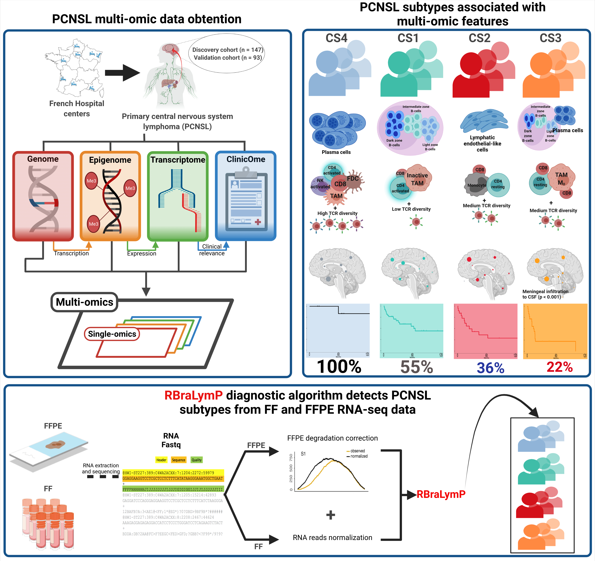
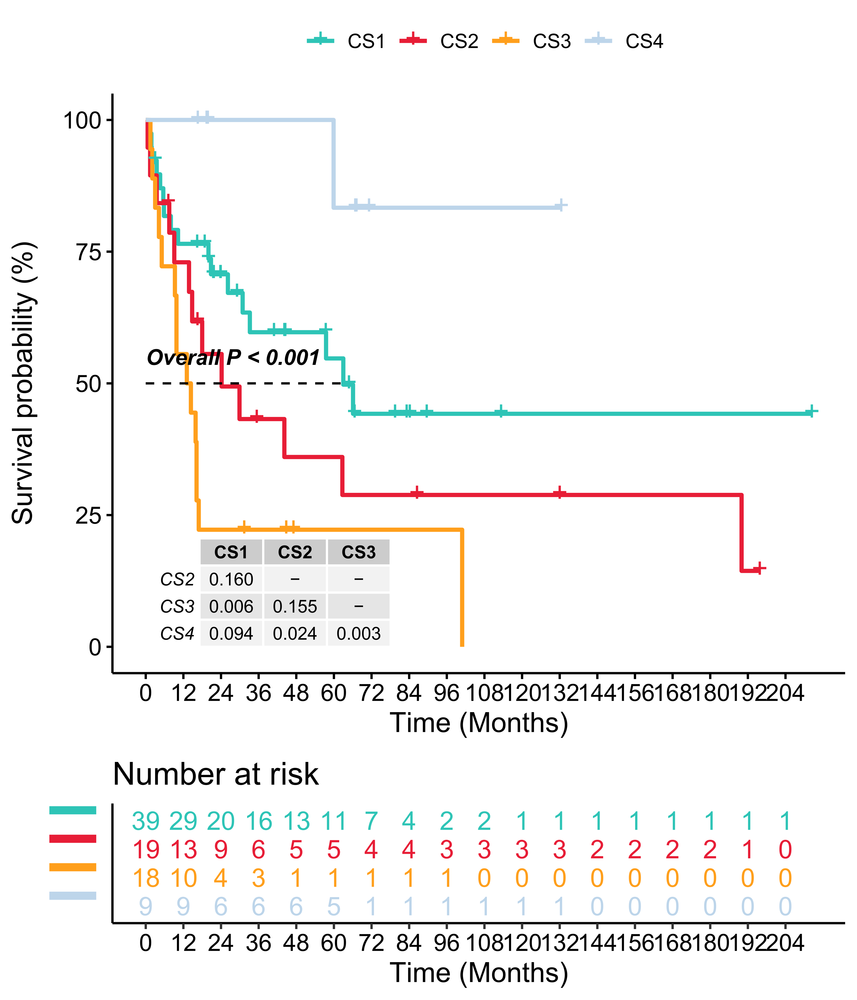

```{r setup, include=FALSE}
knitr::opts_chunk$set(echo = TRUE)
```

# Introduction

The RBraLymP (RNA-based Brain Lymphoma Profiler) is a diagnostic algorithm takes gene expression data from either formalin-fixed, paraffin-embedded (FFPE) or fresh-frozen (FF) tissue for identifying the PCNSL molecular subtypes (CS1 to CS4) associated with multi-omic features and clinical outcome. The multi-omic features include information relative to mutations, copy-number alterations (CNA), fusions, gene expression, TCR/BCR clonotypes, tumor microenvironment (TME), methylation, and tumor localization. The characteristic multi-omic features for each significant cluster (CS) group is described in [Hernandez-Verdin, I. et al. Molecular and clinical diversity in primary central nervous system lymphoma. Annals of Oncology, 2022](https://www.annalsofoncology.org/article/S0923-7534(22)04732-9/fulltext) but generally speaking patients with the “immune-hot” CS4 profile had the most favorable clinical outcome followed by the CS1 group with mutations leading to increased proliferation. Patients belonging to CS2/CS3 groups had the worst outcomes, mainly related to tumor location and/or their TME. The present code provides takes an RNA expression matrix (gene names as rows; samples as columns) as input from either FFPE or FF tissue to output a two column matrix with the "Sample ID" and the "Cluster significant [CS] group". An example on how to use [DegNorm](https://github.com/jipingw/DegNorm) to correct transcript degradation due to the parrafin fixation process, if data is coming from FFPE tissue, is also given. Finally, downstream analysis for evaluating clinical impact using univariate-multivariate models after obtaining the CS groups is covered.



# Load required data.

## Load R packages.

A complete list of packages and versions used to compile this vignette is available at the end. A guide on how to install the base packages is provided [Here](https://github.com/iS4i4S/PCNSL-RBraLymP/blob/main/README.md).

```{r}
library(MOVICS)
library(Hmisc)
library(DESeq2)

#Only if your input data is coming from FFPE tissue
library(DegNorm)
```


## Download and load required data into R.

We will download the data from github. Make sure you have internet connection.

```{r,echo=T,eval=F}
download.file("https://github.com/iS4i4S/PCNSL-RBraLymP/blob/main/Data/RBraLymP.RData", destfile = "RBraLymP.RData", method="libcurl")
load("RBraLymP.RData")
## Take a look at gene expression data. Please, note that Gene_names (as Hugo_symbol) are the rows and samples the columns.
#Example of FF data
print(head(Test_FF_PCNSL))

#Example of FFPE data
print(head(Test_FFPE_PCNSL))
```

# Analyses

The methodology of RBraLymP can be summarized as follows:

1. Determine if your PCNSL RNA-seq data comes from FFPE or FF tissue.

2. Obtain a normalized gene expression matrix with genes as Hugo Symbols.

3. Apply RBraLymP to your normalized gene expression data to identify the PCNSL molecular subtypes.

4. Import your clinical data and estimate uni-multivariate survival models.

## From FFPE RNA-seq data

### DegNorm

When using gene expression data coming FFPE tissue it is highly recommended to correct RNA reads from transcript degradation due to the paraffin fixation process as described in the [Supplementary Appendix](insert_link) from our article. This processes is performed by the R package DegNorm which takes bam files as input (Aligned FASTQ files) and gtf file used for the alignment. The following code is a minimal example edited from [DegNorm Vignette](http://www.bioconductor.org/packages/release/bioc/vignettes/DegNorm/inst/doc/DegNorm.html).

```{r, echo=T,eval=FALSE}
## specify bam_files from RNA-seq, you should replace it by your own bam files
bam_file_list=list.files(path=system.file("extdata",package="DegNorm"),
                        pattern=".bam$",full.names=TRUE)

#The three bam files were subsetted from a specific region of chromosome 21 from the origianl bam for package size limitation. Original files can be found from the included reference above.

## gtf_file you used for RNA-seq alignment, replace it by your own gtf file
gtf_file=list.files(path=system.file("extdata",package="DegNorm"),
                    pattern=".gtf$",full.names=TRUE)
```

1. Run main function to create read coverage matrix and read counts:

```{r, eval=FALSE,echo=T}
## calculate the read coverage score for all genes of all samples
coverage_res_chr21_sub=read_coverage_batch(bam_file_list, gtf_file,cores=6)

#Note: This process might take long times when using all chromosomes, use a high number of cores or subset the number of samples
summary_CoverageClass(coverage_res_chr21_sub)
```

2. DegNorm core algorithm: Run degnorm core algorithm for degradation normalization. DegNorm purpose is for differential expression analysis. Thus genes with extremely low read counts from all samples are filtered out. The current filtering criterion is that if more than half of the samples have less than 5 read count, that gene will not be considered in the degnorm algorithm. The default grid_size is 10 bp. We recommend to use a grid_size less than 50 bp.

```{r, eval=F,echo=T}
res_DegNorm_chr21 = degnorm(read_coverage = coverage_res_chr21_sub[[1]],
                    counts = coverage_res_chr21_sub[[2]],
                    iteration = 5,
                    down_sampling = 1,
                    grid_size=10,
                    loop = 100,
                    cores=8)
##You can visualize the results of this example by running:
data("res_DegNorm_chr21")
summary_DegNormClass(res_DegNorm_chr21)

## extrac normalized read counts
counts_normed=res_DegNorm_chr21$counts_normed
head(counts_normed)
```

```{r,echo=F,eval=T}
head(counts_normed)

```

### Normalizing data using the VST function from DESeq2

We recommend the Variance stabilizing transformation from DESeq2 package to normalize read counts. You can consult the full documentation about this function [Here](https://bioconductor.org/packages/release/bioc/vignettes/DESeq2/inst/doc/DESeq2.html#variance-stabilizing-transformation). Following with the previous example:

```{r, echo=T,eval=F}
#Apply vst function to the DegNorm expression data: counts_normed
#Create a metaData
tmp_metaData<-data.frame(Sample=colnames(counts_normed),Condition=c(rep("Test",2),"Test2"))
  
DESEq_FFPE <- DESeqDataSetFromMatrix(countData = counts_normed, #The DegNormalized gene expression data,
                                       colData = tmp_metaData,
                                       design = ~ Condition)
dds_tmp <- DESeq(DESEq_FFPE)
vsd_tmp <- vst(dds_tmp, blind=FALSE)
#If Error in vst(dds_tmp, blind = FALSE) : less than 'nsub' rows,
  #it is recommended to use varianceStabilizingTransformation directly
#This is because the number of genes is to low...
deseq_vst<-assay(vsd_tmp)
deseq_vst<-as.data.frame(deseq_vst)
head(deseq_vst) ##This is the needed input for RBraLymP
```


### RBraLymP on FFPE data

Now we are ready to use RBraLymP on the normalized gene expression FFPE data!!!

Since the previous example was not PCNSL data, here we are going to work with the `Test_FFPE_PCNSL` which contains gene expression data from 4 samples of our article (each from one different CS group).

```{r, echo=T,eval=T}
##Check the data
head(Test_FFPE_PCNSL)
```

Now use the RBraLymP function:

```{r, echo=T,eval=T}
##data_type can be either FFPE or FF; for FFPE data "doPlot" option is also avaliable
PCNSL_CS_groups<-RBraLymP(data_type = "FFPE",input_expression = Test_FFPE_PCNSL,doPlot = TRUE)
##Check the results
head(PCNSL_CS_groups$ntp.res)


head(PCNSL_CS_groups$clust.res)


```


## From FF RNA-seq data

If data is coming from FF data, DegNorm DO NOT need to be used. Instead only VST normalization of RNA reads is recommended. Considering RNA reads are already normalized, the code is very straightforward:

```{r,echo=T,eval=T}
head(Test_FF_PCNSL)
```

Here we also included a gene expression example of 4 samples from our FF cohort (each from one different CS group). 

Now use the RBraLymP function:

```{r,echo=T,eval=T}
PCNSL_CS_groups<-RBraLymP(data_type = "FF",input_expression = Test_FF_PCNSL)

##Check the results
head(PCNSL_CS_groups$clust.res)

```

## Survival analysis

### Univariate models

To visualize the clinical impact of the PCNSL molecular subtypes on a  Kaplan-Meier Curve, we use the `compSurv` function from the MOVICS package. This function not only calculates the overall nominal P value by log-rank test, but also performs pairwise comparison and derives adjusted P values across the four PCNCSL subtypes. The input of the function are: 1) a moic.res, which is the resulting object from running `RBraLymP`, and 2) a data.frame with clinical information (must has row names of samples) that stores a futime column for survival time (unit of day) and another fustat column for survival outcome (0 = censor; 1 = event).

```{r, eval=T,echo=T}
##Example of needed clinical data
head(Clinic_example)

```

Run the `compSurv` function in the FF cohort. Note that the full clinical data (FF cohort) is not provided, it must be downloaded from the EGAS repository: [EGAS00001006191](https://ega-archive.org/studies/EGAS00001006191).

```{r, eval=F, echo=T}
surv.pcnsl.FF <- compSurv(moic.res         = PCNSL_CS_groups,
                      surv.info        = Clinic_example,
                      convt.time       = "m", # convert day unit to month
                      surv.median.line = "h", # draw horizontal line at median survival
                      xyrs.est         = c(5,10), # estimate 5 and 10-year survival
                      fig.name         = "KAPLAN-MEIER_FF_cohort")

```




### Multivariate models

Multivariate analysis can be calculated as follows:

```{r, echo=T,eval=F}
Clinic_example$IK_binary<-c(rep(">=70",4))
Clinic_example$Age_binary<-c(rep(">=70",4))
head(Clinic_example)
#Full clinical data (FF cohort, n=85) is not provided, it must be downloaded from the [EGAS repository]
ggforest( coxph(Surv(futime, fustat) ~ Cluster_consensus+ IK_binary+ Age_binary, data = Clinic_example),data = Clinic_example,fontsize = 1.5)
```


# Session Information

```{r}
sessionInfo()
```


